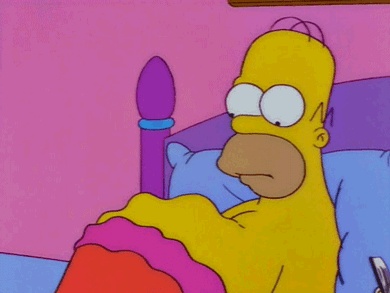

 

<h3><em>Happens to be hungry? Then you've come to the right place!</em></h3>

 

Okay, since I've been in NYC for a while, I thought it would be cool to share some of the food hunts (aka. restaurant explorations) I did in the past year. I am recently into journaling so I thought "why not doing both?". So, I ate and I wrote (so far two of the best things in my life). Unfortunately, the texts are in Chinese but you got the idea!   

# Midori Notebook for Stamps

Scroll through the pictures for more!

 
 
 
 
 
 

# Traveler's Notebook Refill #2
Scroll through the pictures for more! 

 
 
 
 
 

This page keeps updating. The above pictures are just a quick look into my 50+ works. Next time I will upload my traveling food hunts and Ann Arbor restaurant exploration :). But feel free to try more food on your own!! The least stuff I need to worry about is to answer the question "what to have for dinner?"

Back to [homepage](index.html)